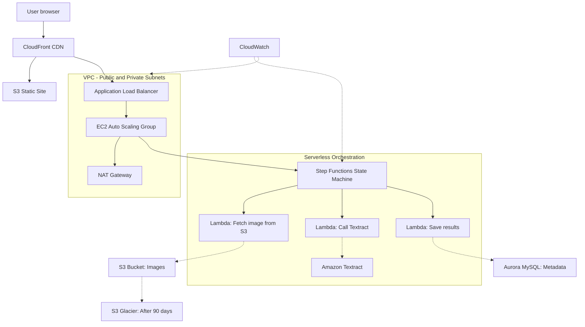

# Worst House in the Best Neighborhood

## Architecture Overview
A 4-tier AWS serverless application built with AWS SAM.

- Tier 1: S3 static website + CloudFront
- Tier 2: ALB + VPC + public/private subnets + NAT Gateway
- Tier 3: Lambda + Step Functions + Amazon Textract
- Tier 4: Aurora MySQL + S3 images bucket + Glacier lifecycle


## Well-Architected Framework Review

### Operational Excellence
**Q: How does the architecture support automated operations and monitoring?**
A: All infrastructure is defined as code in template.yaml using AWS SAM, enabling repeatable deployments with zero manual configuration. CloudWatch monitors Step Functions executions and Lambda invocations automatically, providing visibility into every processing job.

### Security
**Q: How does the architecture enforce least-privilege access and protect data?**
A: All compute and database resources are placed in private subnets with no public internet exposure. IAM roles follow least-privilege principles with specific actions per resource. The NAT Gateway allows outbound-only internet access. S3 buckets use bucket policies to restrict access, and API Gateway acts as the single entry point for all client requests.

### Reliability
**Q: How does the architecture handle failures and ensure availability?**
A: The Application Load Balancer distributes traffic across multiple availability zones. Auto Scaling automatically adds EC2 instances when CPU exceeds 70%, preventing 504 timeouts. Step Functions automatically retries failed Lambda executions. Aurora MySQL provides automated backups and multi-AZ failover capability.

### Performance Efficiency
**Q: How does the architecture scale efficiently to meet demand?**
A: Lambda functions scale automatically with zero idle cost, handling thousands of concurrent image processing requests. CloudFront delivers static assets from edge locations near users, reducing latency. Aurora Serverless v2 scales database capacity up and down based on actual workload.

### Cost Optimization
**Q: How does the architecture minimize unnecessary spending?**
A: Lambda charges only per invocation with no idle cost — estimated at $0.00/month for our workload. S3 Glacier lifecycle rules automatically move images to cheap archival storage after 90 days, reducing storage costs by up to 80%. The total estimated monthly cost is $123.98 based on the AWS Pricing Calculator estimate.

### Operational Excellence
All infrastructure is defined as code in template.yaml using AWS SAM. Deployments are automated via sam build and sam deploy. GitHub commits are linked to issue numbers for full traceability.

### Security
All compute and database resources are in private subnets with no public internet exposure. A NAT Gateway allows outbound-only internet access. Security Groups restrict traffic to specific ports and sources only. IAM roles follow least-privilege principles with specific actions and resources.

### Reliability
The Application Load Balancer distributes traffic across multiple availability zones. Auto Scaling responds to CPU load to prevent 504 timeouts. Aurora MySQL provides managed database reliability with automated backups.

### Performance Efficiency
CloudFront delivers static assets from edge locations near users. Lambda functions scale automatically with zero idle cost. Aurora MySQL handles structured metadata queries efficiently.

### Cost Optimization
Lambda charges only per invocation with no idle cost. S3 Glacier lifecycle rules move images to cheap storage after 90 days. Aurora Serverless v2 scales down during low traffic periods.

### Sustainability
Right-sized resources prevent over-provisioning. Serverless architecture means compute runs only when needed, reducing energy waste compared to always-on servers.

## Data Retention Policy
- Images uploaded to S3 are retained for 90 days in standard storage
- After 90 days images are automatically moved to S3 Glacier
- After 7 years (2555 days) images are permanently deleted
- Aurora database metadata is retained indefinitely unless manually purged

## Deployment Instructions
```bash
sam build && sam deploy
```

## Teardown Instructions
```bash
sam delete --stack-name worst-house
```

## Trusted Advisor Findings
AWS Academy lab accounts have limited Trusted Advisor access and do not provide full check results. The following security best practices were manually verified instead:

- Security Groups: Only ports 80 and 443 are open to the public
- S3 Buckets: Only the frontend bucket is public, images bucket is private
- IAM: All roles use least-privilege policies with no wildcard resources
- MFA: Enabled on the root account
- Cost: No unused Elastic IPs or idle load balancers detected

## TCO Report (Annual Cost Estimate)

Estimated using AWS Pricing Calculator for 1 year of operations.

| Service | Monthly Cost |
|---------|-------------|
| Amazon Aurora MySQL | $57.54 |
| NAT Gateway (VPC) | $33.30 |
| Elastic Load Balancing | $31.03 |
| Amazon S3 | $1.16 |
| Amazon CloudFront | $0.95 |
| AWS Lambda | $0.00 |
| **Total** | **$123.98/month** |

**Total 12-month cost: $1,487.76**

Full estimate: [AWS Pricing Calculator]([200~https://calculator.aws/#/estimate?id=618d371e412ece198d9a9a19fefd7e65e17347a1~)


## Architecture Diagram


